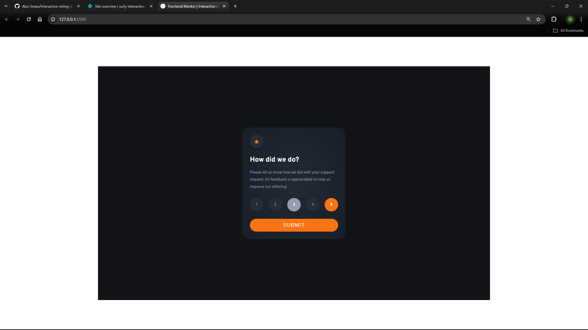

# Frontend Mentor - Interactive rating component solution

This is a solution to the [Interactive rating component challenge on Frontend Mentor](https://www.frontendmentor.io/challenges/interactive-rating-component-koxpeBUmI). Frontend Mentor challenges help you improve your coding skills by building realistic projects.

## Table of contents

- [Overview](#overview)
  - [The challenge](#the-challenge)
  - [Screenshot](#screenshot)
  - [Link](#link)
- [My process](#my-process)
  - [Built with](#built-with)
  - [Useful resources](#useful-resources)
- [Author](#author)
- [Acknowledgments](#acknowledgments)

## Overview

### The challenge

Users should be able to:

- View the optimal layout for the app depending on their device's screen size
- See hover states for all interactive elements on the page
- Select and submit a number rating
- See the "Thank you" card state after submitting a rating

### Screenshot

### Links

- Live Site URL: [Live site URL](https://sully-interactive-rating-component.netlify.app/)

## My process

### Built with

- Semantic HTML5 markup
- Flexbox
- Desktop-first workflow
- Vanilla Javascript

### Useful resources

- [JavaScript](https://www.udemy.com/course/the-complete-javascript-course/) - One of the best Javascript course out there.
- [HTML and CSS](https://www.udemy.com/course/design-and-develop-a-killer-website-with-html5-and-css3/) - HTML and CSS course.

## Author

- Frontend Mentor - [@Abu-Sman](https://www.frontendmentor.io/profile/Abu-Sman)
- Twitter - [@Abu_Sman01](https://www.twitter.com/Abu_Sman01)

## Acknowledgments

Big shoutout to Jonas Schmedtmann for being an amazing tutor! You're the best out there!
